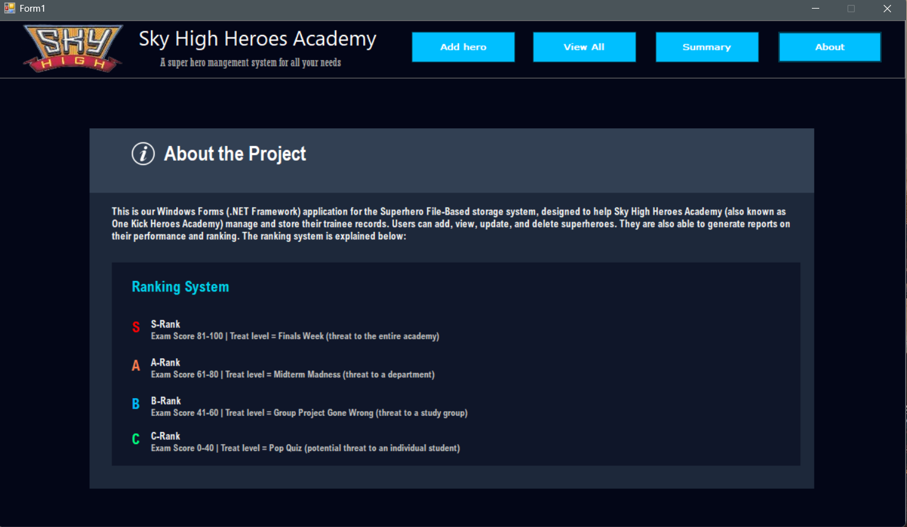

# Sky High - Version-Controlled Superhero Database System

## Project Overview

Sky High is a C# Windows Forms application used to manage superhero records for the One Kick Heroes Academy HQ unit.

## Why “Sky High”?

We renamed our application to **Sky High** (with permission from our lecturer `Ikraam Sadek`), inspired by the Disney film [*Sky High*](https://www.rottentomatoes.com/m/1142872-sky_high). The app’s theme is designed to match the movie, and the included mock data is based on its characters.

## Mock Data

Use the following in your `superheroes.txt` file:

```
H01|Will Stronghold|15|Super Strength AND Flight|78|A-Rank|Midterm Madness
H02|Layla Williams|15|Plant Manipulation|85|S-Rank|Finals Week
H03|Warren Peace|16|Pyrokinesis|90|S-Rank|Finals Week
H04|Zach|15|Glow-in-the-Dark|42|B-Rank|Group Project Gone Wrong
H05|Magenta|15|Shape-shifting AND Animal Form|55|B-Rank|Group Project Gone Wrong
H06|Ethan|15|Melting|38|C-Rank|Pop Quiz
H07|Gwen Grayson|16|Charm AND Technopathy|95|S-Rank|Finals Week
H08|Speed|15|Super Speed|73|A-Rank|Midterm Madness
H09|Lash|15|Elasticity|47|B-Rank|Group Project Gone Wrong
H10|Boomer|35|Sonic Voice|88|S-Rank|Finals Week
H11|Principal Powers|50|Transformation AND Leadership|100|S-Rank|Finals Week
H12|Coach Boomer|40|Sound Manipulation|82|S-Rank|Finals Week
H13|Royal Pain|17|Mind Control AND Illusion|100|S-Rank|Finals Week
H14|The Commander|40|Super Strength|91|S-Rank|Finals Week
H15|Jetstream|18|Flight|89|S-Rank|Finals Week
```

## Features

### 1. Add New Superhero

* Input superhero details using a Windows C# Form, (Hero ID, Name, Age, Superpower, Exam Score)
* Automatic calculation of rank and threat level based on exam score
* Validation for all input fields
* Records saved to `superheroes.txt`

### 2. View All Superheroes

* Display all records in a DataGridView
* Shows Hero ID, Name, Age, Superpower, Exam Score, Rank, and Threat Level

### 3. Update Superhero Information

* Search and select superheroes
* Edit existing records
* Rank and threat level are recalculated automatically if exam score changes
* Updates saved to `superheroes.txt`

### 4. Delete a Superhero

* Remove records from the database
* DataGridView refreshes after deletion

### 5. Generate Summary Report

* Total number of superheroes
* Average age and exam score
* Hero count per rank 
* Summary saved to `summary.txt`

#### `summary.txt`

```
=== HERO SUMMARY REPORT ===

Total Number of Heroes: 5
Average Age: 22.4
Average Exam Score: 69.8

Number of Heroes per Rank:
S-Rank: 2
A-Rank: 1
B-Rank: 1
C-Rank: 1

Generated On: 10/9/2025 5:15:37 PM
================================
```

## Ranking System

Please see the **About** form for ranking details :)

## Screenshots

### Add Hero Page


### View All Heroes Page


### Summary Report Page


### About Page



## Installation

1. Clone the repository:

   ```bash
   git clone https://github.com/Waldo-Blom/PRG282-Sky_High_Super_Hero_Academy.git
   ```

2. Open in Visual Studio:

   * Launch Visual Studio
   * Open the `.sln` file

3. Run the application:

   * Press `F5`

4. If you get build errors like:

```
Couldn't process file PresentationLayer\AboutUserControl.resx due to its being in the Internet or Restricted zone or having the mark of the web on the file...
```

This happens when `.resx` files are marked as downloaded from the internet. To fix:

* Navigate to `Sky_High_Super_Hero_Academy/PresentationLayer`
* Right-click each `.resx` file → **Properties**
* Under **Security**, check **Unblock**

5. Rerun the application.

## File Structure

```
├─ README.md
├─ .gitignore
├─ LICENSE
└─ Sky_High_Super_Hero_Academy/
   ├─ Sky_High_Super_Hero_Academy.sln      # Solution file
   ├─ Program.cs
   ├─ Properties/
   │  └─ AssemblyInfo.cs
   ├─ BusinessLayer/
   │  ├─ Superhero.cs
   │  └─ SummaryLogic.cs
   ├─ DataAccessLayer/
   │  ├─ Superhero_FileHandler.cs
   │  └─ Summary_FileHandler.cs
   ├─ PresentationLayer/
   │  ├─ Images/
   │  │  └─ (...UI images/icons...)
   │  ├─ AboutUserControl.cs
   │  ├─ AboutUserControl.Designer.cs
   │  ├─ AboutUserControl.resx
   │  ├─ AddHeroUserControl.cs
   │  ├─ AddHeroUserControl.Designer.cs
   │  ├─ AddHeroUserControl.resx
   │  ├─ EditHeroForm.cs
   │  ├─ MainApplication.cs
   │  ├─ MainApplication.Designer.cs
   │  ├─ MainApplication.resx
   │  ├─ SummaryUserControl.cs
   │  ├─ SummaryUserControl.Designer.cs
   │  ├─ SummaryUserControl.resx
   │  ├─ ViewAllUserControl.cs
   │  ├─ ViewAllUserControl.Designer.cs
   │  ├─ ViewAllUserControl.resx
   ├─ bin/
   │  ├─ Debug/
   │  │  ├─ Sky_High_Super_Hero_Academy.exe
   │  │  ├─ Sky_High_Super_Hero_Academy.exe.config
   │  │  ├─ Sky_High_Super_Hero_Academy.pdb
   │  │  ├─ summary.txt
   │  │  └─ superheroes.txt
   │  └─ Release/
   └─ obj/
      └─ (build artifacts)
```

## Authors
* Waldo Blom (578068) - [GitHub](https://github.com/Waldo-Blom)
* Alex Solomon (601638) - [GitHub](https://github.com/Waldo-Blom/PRG282-Sky_High_Super_Hero_Academy/commit/cfb4eb88e6dbbbbf0c1ef8efaef1acba512b0edb)
* Christian Janse van Rensburg (601840) - [GitHub](https://github.com/Christian-jvr)
* Willem Johannes Booysen (600613) - [GitHub](https://github.com/Drago1117)
